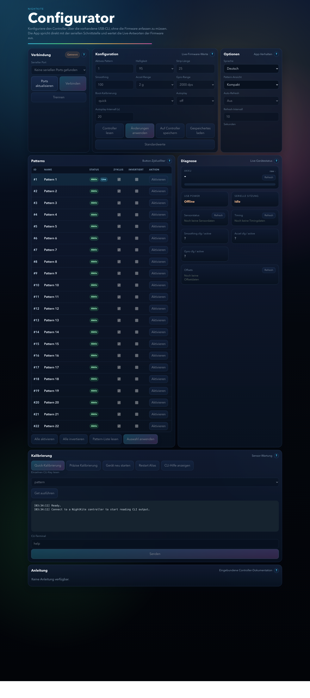

# NightKite Configurator

Desktop configuration tool for the NightKite Multi firmware.

Deutsch: [README Deutsch](#deutsch)  
English: [README English](#english)

## Deutsch

Der NightKite Configurator ist eine Desktop-App für die laufende Konfiguration, Diagnose und Kalibrierung der NightKite-Multi-Firmware über USB-Serial. Die App nutzt die vorhandene Firmware-CLI direkt, wertet `OK`, `ERR` und `INFO`-Antworten aus und stellt die wichtigsten Controller-Funktionen in einer grafischen Oberfläche bereit.

### Überblick

- `Tauri + React + TypeScript`
- native serielle Bridge im Tauri-Backend über `serialport`
- direkte Nutzung der bestehenden NightKite-CLI
- Live-Auswertung von spontanen Firmware-Meldungen wie Pattern-Wechseln
- eingebundene Dokumentation in Deutsch und Englisch
- umschaltbare Pattern-Ansicht in `Kompakt` oder `Komfort`
- ausgelegt für die aktuelle NightKite-Multi-Firmware mit 22 Pattern, Pattern-Richtungen und Autoplay

### Screenshots

Langer Überblick der laufenden Dev-Version:



### Funktionsübersicht

**Verbindung**

- serielle Ports auflisten und aktualisieren
- Controller verbinden und trennen
- Verbindungsstatus live anzeigen
- Port-Verlust erkennen und sauber behandeln

**Konfiguration**

- aktives Pattern direkt setzen
- Helligkeit live ändern
- Strip-Länge setzen
- Motion-Smoothing, Accel-Range, Gyro-Range und Boot-Kalibrierung konfigurieren
- Autoplay global ein- und ausschalten
- Autoplay-Intervall setzen
- aktuelle Werte vom Controller lesen
- laufende Werte anwenden
- `save`, `load` und `defaults` ausführen

**Pattern-Verwaltung**

- alle Pattern mit Status anzeigen
- zwischen `Kompakt`- und `Komfort`-Ansicht umschalten
- aktive Pattern für das Button-Cycling ein- und ausschalten
- Laufrichtung pro Pattern invertieren oder normalisieren
- Pattern direkt aus der App aktivieren
- Sammelaktionen:
  - alle Pattern aktivieren
  - alle Pattern bis auf Pattern 1 deaktivieren
  - alle Pattern invertieren
  - alle Pattern wieder normalisieren

**Diagnose**

- `battery`, `sensor`, `timing` und `offsets` lesen
- Live-Zusammenfassungen für Sensor-, Timing- und Offset-Daten
- Konfigurations- und Aktivwerte vergleichen, um reboot-pflichtige Änderungen zu erkennen

**Kalibrierung und CLI**

- `calibrate quick`
- `calibrate precise`
- `reboot` und `restart`
- `help`
- einzelne `get ...`-Werte direkt lesen
- freie CLI-Kommandos aus der App senden
- laufendes Terminal-/Log-Fenster mit Zeitstempeln

**Dokumentation**

- deutsches und englisches Manual direkt in der App eingebunden
- Umschaltung der Sprache ohne externen Browser

### Unterstützte Firmware-Funktionen

Die App unterstützt aktuell unter anderem:

- `show`
- `patterns`
- `battery`
- `sensor`
- `timing`
- `offsets`
- `get pattern`
- `get brightness`
- `get strip_length`
- `get smoothing`
- `get accel_range`
- `get gyro_range`
- `get boot_calibration`
- `get autoplay`
- `get autoplay_interval`
- `get enabled_patterns`
- `get inverted_patterns`
- `set pattern <1..22>`
- `set brightness <95|127|159|191|223|255>`
- `set strip_length <10..35>`
- `set smoothing <1..512>`
- `set accel_range <2|4|8|16>`
- `set gyro_range <250|500|1000|2000>`
- `set boot_calibration <off|quick>`
- `set autoplay <on|off>`
- `set autoplay_interval <1..300>`
- `enable_pattern <1..22[,id...]>`
- `disable_pattern <1..22[,id...]>`
- `invert_pattern <1..22[,id...]>`
- `normal_pattern <1..22[,id...]>`
- `save`
- `load`
- `defaults`
- `reboot`
- `restart`
- `calibrate quick`
- `calibrate precise`

### Bedienkonzept der App

- Änderungen im Bereich **Konfiguration** werden gesammelt und mit `Änderungen anwenden` in die laufende Firmware geschrieben.
- Die **Helligkeit** wird bewusst live gesetzt.
- Änderungen im Bereich **Patterns** werden separat gesammelt und mit `Auswahl anwenden` übertragen.
- Die Pattern-Ansicht wird in **Optionen** zwischen `Kompakt` und `Komfort` umgeschaltet.
- Standardmäßig startet die App in der **Kompaktansicht**, sofern lokal keine andere Ansicht gespeichert ist.
- Spontane Firmware-Meldungen wie `INFO pattern_changed ...` und `INFO autoplay=...` werden live ausgewertet.
- Reboot-pflichtige Änderungen werden in der App markiert.

### Dokumentation

- App-Anleitung Deutsch: [docs/manual_de.md](docs/manual_de.md)
- App-Manual English: [docs/manual_en.md](docs/manual_en.md)

### GitHub Actions

- Der Workflow [`.github/workflows/windows-installer.yml`](.github/workflows/windows-installer.yml) baut auf GitHub automatisch einen Windows-NSIS-Installer.
- Er läuft manuell über `workflow_dispatch` oder automatisch bei relevanten Änderungen auf `main`.
- Das Ergebnis wird als GitHub-Artifact `nightkite-configurator-windows-installer` bereitgestellt.

### Entwicklung

Frontend bauen:

```bash
npm install
npm run build
```

Desktop-App im Entwicklungsmodus starten:

```bash
npm install
npm run tauri dev
```

Debug-App-Bundle erstellen:

```bash
npm run tauri build -- --debug --bundles app
```

macOS-`dmg` erstellen:

```bash
npm run build:dmg
```

### Hinweise

- Die App ist gegen das aktuelle NightKite-Multi-CLI-Protokoll gebaut.
- Änderungen an der Firmware-CLI können Parser, Logik oder UI-Anpassungen im Configurator erfordern.
- Der macOS-`dmg`-Build ist eingerichtet und wurde erfolgreich verifiziert.

## English

The NightKite Configurator is a desktop app for live configuration, diagnostics, and calibration of the NightKite Multi firmware over USB serial. It talks to the existing firmware CLI directly, parses `OK`, `ERR`, and `INFO` replies, and exposes the most important controller functions through a graphical interface.

### Overview

- `Tauri + React + TypeScript`
- native serial bridge in the Tauri backend using `serialport`
- direct use of the existing NightKite CLI
- live processing of spontaneous firmware messages such as pattern changes
- embedded German and English manuals
- switchable pattern view in `Compact` or `Comfort`
- designed for the current NightKite Multi firmware with 22 patterns, per-pattern direction control, and autoplay

### Screenshots

Full long screenshot of the running dev version:


### Feature Overview

**Connection**

- list and refresh serial ports
- connect to and disconnect from the controller
- show live connection state
- detect port loss and recover cleanly

**Configuration**

- set the active pattern directly
- change brightness live
- set strip length
- configure motion smoothing, accel range, gyro range, and boot calibration
- enable or disable autoplay globally
- set the autoplay interval
- read current values from the controller
- apply staged configuration changes
- run `save`, `load`, and `defaults`

**Pattern Management**

- show all patterns with status
- switch between `Compact` and `Comfort` view
- enable or disable patterns for button-based cycling
- invert or normalize animation direction per pattern
- activate a pattern directly from the app
- bulk actions:
  - enable all patterns
  - disable all but pattern 1
  - invert all patterns
  - normalize all patterns

**Diagnostics**

- read `battery`, `sensor`, `timing`, and `offsets`
- show live summaries for sensor, timing, and offset data
- compare configured and active sensor settings to detect reboot-required changes

**Calibration and CLI**

- `calibrate quick`
- `calibrate precise`
- `reboot` and `restart`
- `help`
- read individual `get ...` values directly
- send free-form CLI commands from the app
- live terminal/log panel with timestamps

**Documentation**

- embedded German and English manuals inside the app
- language switching without opening an external browser

### Supported Firmware Features

The app currently supports, among other things:

- `show`
- `patterns`
- `battery`
- `sensor`
- `timing`
- `offsets`
- `get pattern`
- `get brightness`
- `get strip_length`
- `get smoothing`
- `get accel_range`
- `get gyro_range`
- `get boot_calibration`
- `get autoplay`
- `get autoplay_interval`
- `get enabled_patterns`
- `get inverted_patterns`
- `set pattern <1..22>`
- `set brightness <95|127|159|191|223|255>`
- `set strip_length <10..35>`
- `set smoothing <1..512>`
- `set accel_range <2|4|8|16>`
- `set gyro_range <250|500|1000|2000>`
- `set boot_calibration <off|quick>`
- `set autoplay <on|off>`
- `set autoplay_interval <1..300>`
- `enable_pattern <1..22[,id...]>`
- `disable_pattern <1..22[,id...]>`
- `invert_pattern <1..22[,id...]>`
- `normal_pattern <1..22[,id...]>`
- `save`
- `load`
- `defaults`
- `reboot`
- `restart`
- `calibrate quick`
- `calibrate precise`

### App Workflow

- Changes in **Configuration** are staged and written to the running firmware with `Apply Changes`.
- **Brightness** is intentionally applied live.
- Changes in **Patterns** are staged separately and sent with `Apply Selection`.
- The pattern view can be switched in **Options** between `Compact` and `Comfort`.
- By default the app starts in **Compact** view unless another choice is already stored locally.
- Spontaneous firmware messages such as `INFO pattern_changed ...` and `INFO autoplay=...` are processed live.
- Reboot-required changes are highlighted in the UI.

### Documentation

- App manual German: [docs/manual_de.md](docs/manual_de.md)
- App manual English: [docs/manual_en.md](docs/manual_en.md)

### GitHub Actions

- The workflow [`.github/workflows/windows-installer.yml`](.github/workflows/windows-installer.yml) builds a Windows NSIS installer on GitHub.
- It can be started manually with `workflow_dispatch` or runs automatically for relevant changes on `main`.
- The result is uploaded as the GitHub artifact `nightkite-configurator-windows-installer`.

### Development

Build the frontend:

```bash
npm install
npm run build
```

Run the desktop app in development:

```bash
npm install
npm run tauri dev
```

Create a debug app bundle:

```bash
npm run tauri build -- --debug --bundles app
```

Create a macOS `dmg`:

```bash
npm run build:dmg
```

### Notes

- The app is built against the current NightKite Multi CLI protocol.
- Firmware CLI changes may require parser, logic, or UI updates in the configurator.
- The macOS `dmg` build is configured and has been verified successfully.
